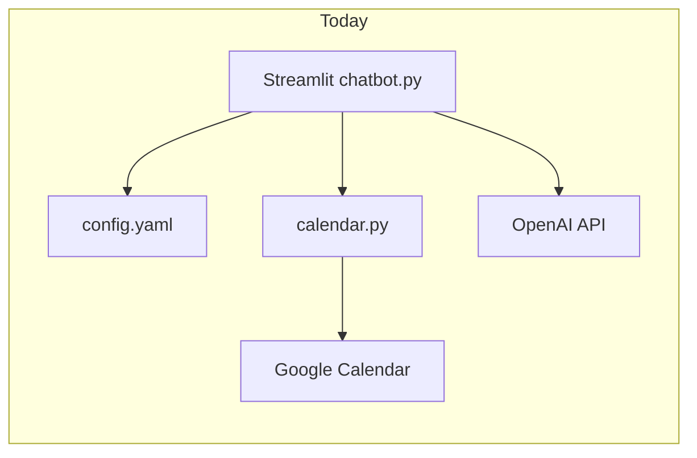
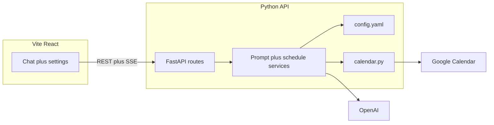

# Migration: Streamlit to Vite + React (local webapp)

Saved copy of the migration plan for later execution. Source discussion was Cursor plan **Vite React migration** (2026).

## Current state

- All product logic lives in [src/chatbot.py](../src/chatbot.py): sidebar preferences (rest day, duration), chat with **streaming** OpenAI completions, busy slots from Google Calendar, prompt assembly from [src/app/config.yaml](../src/app/config.yaml), JSON conversion of the last assistant message, overlap checks (inline `parse_iso_dt` / `to_session_interval`), then [src/app/calendar.py](../src/app/calendar.py) `add_sessions_to_calendar`.
- Calendar auth in [src/app/calendar.py](../src/app/calendar.py) `get_calendar_service()` uses `InstalledAppFlow.run_local_server(port=0)` when there is no valid token. That is acceptable when a human runs Streamlit locally; it is a poor fit for an HTTP request from React (blocking browser launch, race conditions, no clear UX).

## Target architecture

- **React**: layout (sidebar + main chat), message list state, streaming assistant text (SSE or NDJSON), “Validate and schedule” button calling one backend endpoint.
- **Python API** (recommended: **FastAPI** + `uvicorn`): owns `OPENAI_API_KEY`, loads prompts, calls existing calendar helpers, implements the same conflict algorithm (extract from `chatbot.py` into a small module to avoid duplication).

## Repository layout (monorepo)

- Keep Python package under `src/` (or introduce `backend/` mirroring `src/app`—either works; minimal churn is keeping [src/app/calendar.py](../src/app/calendar.py) and [src/app/config.yaml](../src/app/config.yaml) paths stable and adding e.g. `src/api/main.py` + routers).
- Add `frontend/` with `npm create vite@latest` (React + TypeScript), env via Vite `proxy` to the API in dev (e.g. `/api` → `http://127.0.0.1:8000`).

## API design (mirror current behavior)

| Concern | Suggested endpoint | Notes |
|--------|---------------------|--------|
| Busy intervals for prompts + UI | `GET /api/calendar/busy?limit=50` | Returns `{ start, end }[]` like today’s `calendar_busy_intervals`. |
| Chat (streaming) | `POST /api/chat/stream` | Body: `{ messages, rest_day, duration_min, model? }`. Server fetches busy slots, formats [plain_text_system_prompt](../src/app/config.yaml), streams OpenAI tokens (SSE `text/event-stream`). |
| Schedule | `POST /api/schedule/commit` | Body: `{ last_assistant_plain_text, rest_day, duration_min, model? }`. Server runs convert prompt + `json.loads` + conflict filter + `add_sessions_to_calendar`; returns `{ scheduled, skipped_conflicts, errors }`. |

Server must **never** trust client-built system prompts for scheduling security; always re-fetch busy list on commit.

## Google OAuth (explicit migration task)

- **Short term (fastest path):** Require a valid `credentials/token.json` before using the API; if `get_calendar_service()` would enter `run_local_server`, return **503** with a JSON message: run a one-shot `python -m ... auth` (small script wrapping the existing flow) or document using Streamlit once. Removes surprise browser launches from API threads.
- **Better UX (same machine):** Add `GET /api/auth/google/start` → redirect to Google, `GET /api/auth/google/callback` with a fixed redirect URI (e.g. `http://127.0.0.1:8000/api/auth/google/callback`) registered in Google Cloud Console for “Desktop” or “Web” client as appropriate. Persist token the same way as today. React shows “Connect Calendar” linking to `/api/auth/google/start`.
- Choose one path for v1 of the React app; the second can be a follow-up PR.

## Frontend implementation notes

- **State**: `messages: { role, content }[]`, preferences mirroring sidebar defaults.
- **Streaming**: consume SSE from `fetch` + `ReadableStream` or `EventSource` if you use GET (POST + SSE usually needs `fetch` + manual parser).
- **CORS**: allow `http://localhost:5173` (and production origin if you later host the static build).
- **Optional**: model dropdown persisted in `localStorage` (currently [src/chatbot.py](../src/chatbot.py) uses `gpt-3.5-turbo`).

## Refactor inside Python (before or with API)

- Extract from [src/chatbot.py](../src/chatbot.py) into e.g. `src/app/schedule.py` (or `src/app/chat_service.py`):
  - building `busy_context` string from events list
  - formatting planning and convert system prompts
  - `parse_iso_dt`, `to_session_interval`, overlap loop, partition into conflicting / non-conflicting
- Leave [src/app/calendar.py](../src/app/calendar.py) as the single integration point for Google; only adjust OAuth entry as above.

## Dependencies and runbooks

- **Python**: add `fastapi`, `uvicorn[standard]`; Streamlit can remain for a transition period or be removed once parity is verified ([requirements.txt](../requirements.txt)).
- **Dev**: two processes—`uvicorn src.api.main:app --reload` and `npm run dev` in `frontend/` with proxy.
- **README**: document `TIMEZONE`, `.env` for `OPENAI_API_KEY`, Google credentials paths, and how to obtain the first token / connect OAuth.

## Testing

- Port or add tests that call the extracted schedule logic with fake busy intervals and fake sessions (no Google). Existing [src/tests/test_prompt_parameters.py](../src/tests/test_prompt_parameters.py) is prompt-only; extend or add API-level tests with `TestClient` for `/api/schedule/commit` with mocked calendar + OpenAI.

## Out of scope (unless you want them in the same project)

- Hosting the Vite build on a public URL with the API on another host (CORS, HTTPS, OAuth redirect domains).
- Moving OpenAI calls to the browser (would expose the API key).
