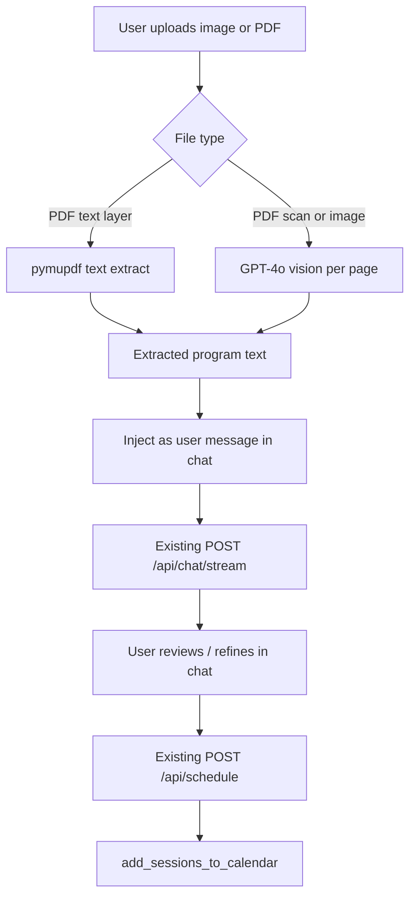

# Plan — File Import (image / PDF → chat → calendar)

Projet : Sports Sessions Planner  
Statut : **planifié** (non implémenté)  
Flux retenu : **extraire → revue dans le chat → « Valider et planifier »**

---

## Résumé

Ajouter l’upload d’une image ou d’un PDF pour en extraire un programme d’entraînement (vision / texte), l’injecter dans le flux coach existant pour relecture et affinage, puis réutiliser le pipeline actuel (`POST /api/schedule`) pour écrire les séances dans Google Calendar.

---

## Évaluation de complexité

**Global : moyen** (~2–3 jours de dev pour un MVP solide)

| Zone | Effort | Pourquoi |
|------|--------|----------|
| Backend upload + extraction | Moyen | Nouvel endpoint, validation MIME, branchement PDF vs image, API vision |
| Réutilisation chat + schedule | Faible | ~80 % du chemin d’écriture existe déjà dans `src/planner.py` |
| UI upload frontend | Faible–moyen | File picker, états loading/erreur, branchement chat |
| Prompts pour imports | Moyen | Formats hétérogènes ; dates souvent absentes dans les fichiers source |
| Tests | Faible | Mock vision, validation MIME/taille |

### Ce qui rend le projet faisable

- OAuth Calendar, détection de conflits et création d’événements sont déjà en place (`src/google_calendar.py`, `schedule_from_last_assistant()`).
- Le flux « revue dans le chat » évite un 3ᵉ algorithme de planification : le contenu extrait devient une entrée chat, puis le pipeline coach → conversion JSON → écriture reste inchangé.

### Risques principaux

- **PDF scannés / photos** : nécessite un modèle vision (`gpt-4o` ou équivalent), pas `gpt-3.5-turbo`.
- **Plans sans dates/heures** : les fichiers listent souvent seulement les exercices ; le prompt coach doit proposer des créneaux via busy intervals + préférences sidebar (`src/config.yaml`).
- **Qualité d’extraction** : erreurs OCR/vision → atténuées par la relecture dans le chat.
- **Coût / latence** : vision sur PDF multi-pages plus lent et plus cher que le chat texte.



---

## Architecture recommandée

### Nouveau module : `src/document_import.py`

Responsabilité unique : bytes + MIME type → texte brut extrait.

```python
def extract_training_plan_text(
    file_bytes: bytes,
    mime_type: str,
    *,
    client: OpenAI,
    model: str = "gpt-4o",
) -> str:
    ...
```

**Logique de branchement**

1. **Images** (`image/jpeg`, `image/png`, `image/webp`) : base64 → message vision OpenAI avec prompt d’extraction ciblé (« retourner uniquement le texte du programme, préserver la structure »).
2. **PDF avec couche texte** (pymupdf / `fitz`) : extraction texte par page ; si total chars > seuil (ex. 200), chemin texte (moins cher, pas de vision).
3. **PDF sans texte** (scanné) : rendu pages en PNG (pymupdf) → vision par page → concaténation.
4. **Non supporté** : rejet HTTP 415.

**Limites MVP**

- Taille max : 10 Mo
- Pages PDF max pour vision : 10 (configurable)
- Types MIME autorisés uniquement (pas de `.docx` en v1)

### Nouvel endpoint API : `POST /api/import/extract`

Dans `src/server.py` :

```python
@app.post("/api/import/extract")
async def import_extract(file: UploadFile = File(...)) -> Dict[str, Any]:
    # validate MIME + size → extract_training_plan_text
    # → return { extracted_text, source_filename, page_count? }
```

Retourne du JSON uniquement — **ne planifie pas**. Le frontend utilise le texte pour amorcer le chat.

Paramètre optionnel pour plus tard : override `model`.

### Frontend : point d’entrée upload dans le chat

Dans `frontend/src/components/ChatArea.tsx` (ou petit composant `FileUploadButton.tsx`) :

1. `<input type="file" accept="image/*,.pdf">` caché + icône trombone/upload à côté du bouton envoyer.
2. À la sélection → `POST /api/import/extract` via `FormData` (nouvelle fonction `importTrainingPlan()` dans `frontend/src/api.ts`).
3. En succès → message **user**, par ex. :
   > *Programme importé depuis `plan.pdf` :*
   > ```
   > {extracted_text}
   > ```
   > *Propose un planning avec dates et horaires adaptés à mon agenda.*
4. Déclencher automatiquement `streamChatCompletion()` pour que le coach produise un plan texte calé sur l’agenda.
5. L’utilisateur affine comme aujourd’hui → **« Valider et planifier »** → `scheduleSessions()` existant.

Aucun changement sur `POST /api/schedule` ni sur le schéma de session `{ date, time, duration_min, title, description }`.

### Ajouts prompts dans `src/config.yaml`

- **`import_extraction_prompt`** : pré-parse vision/texte.
- **Mode D — Importer un fichier** dans `plain_text_system_prompt` :
  - Message user contenant du texte importé → matière source (pas un planning finalisé).
  - Mapper exercices → séances datées via busy intervals, jours de repos, durée préférée.
  - Si le fichier a des dates explicites, les respecter si pas de conflit ; sinon proposer des créneaux.
  - Même format de sortie que modes B/C : Date, Heure, Titre, Durée, Description.

Garder `convert_system_prompt` inchangé.

### Configuration modèle

- Variable d’env `OPENAI_VISION_MODEL=gpt-4o` (ou `gpt-4o-mini` pour réduire le coût).
- Chat/schedule peuvent rester sur `gpt-3.5-turbo` par défaut ; seule l’extraction utilise le modèle vision.
- Documenter dans le README que l’import fichier nécessite un modèle compatible vision.

### Dépendances

Ajouter à `requirements.txt` :

```
pymupdf>=1.24.0          # extraction texte PDF + rendu pages
python-multipart>=0.0.9  # uploads FastAPI
```

Pas de nouveau package frontend.

---

## Fichiers à créer / modifier

| Fichier | Changement |
|---------|------------|
| **Nouveau** `src/document_import.py` | Détection MIME, extraction PDF/image, appels vision |
| `src/server.py` | `POST /api/import/extract`, gestion `UploadFile` |
| `src/config.yaml` | `import_extraction_prompt` + Mode D dans le prompt coach |
| `src/planner.py` | Optionnel : helper `build_import_user_message(text, filename)` |
| `frontend/src/api.ts` | `importTrainingPlan(file: File)` |
| `frontend/src/components/ChatArea.tsx` | Bouton upload, loading, auto-envoi après extract |
| **Nouveau** `src/tests/test_document_import.py` | Validation MIME, vision mockée, chemin PDF texte |
| `requirements.txt` | pymupdf, python-multipart |
| `README.md` | Feature import, env modèle vision, formats supportés |

### Hors scope v1

- Word / Excel, fetch URL, multi-fichiers
- Planification directe sans revue chat
- Persistance des fichiers uploadés sur disque (traitement en mémoire, puis discard)
- Import iCal

---

## Séquence d’implémentation

### Phase 1 — Extraction backend (½ journée)

- Créer `document_import.py` : chemins image + PDF texte.
- Tests unitaires avec PDF fixture (couche texte) et client OpenAI mocké.

### Phase 2 — Vision + PDF scanné (½ journée)

- Rendu pages + boucle vision pour PDF sans texte.
- Prompt d’extraction dans `config.yaml`.
- Plafond pages, erreur claire si extraction vide.

### Phase 3 — API + frontend (½ journée)

- `POST /api/import/extract` avec garde-fous taille/MIME.
- Bouton upload, `importTrainingPlan()`, message coach auto.

### Phase 4 — Prompt coach + polish (½ journée)

- Mode D dans `plain_text_system_prompt`.
- UX : spinner « Analyse du fichier… », toasts erreur, désactiver envoi pendant extract.
- Test manuel golden path : photo → revue → schedule → vérif events Google Calendar.

### Phase 5 — Tests + doc (½ journée optionnelle)

- Test d’intégration : mock extract → mock chat stream → schedule (patterns dans `src/tests/test_server_chat_stream.py`).
- Section README.

---

## Plan de tests

1. **PDF texte** — export digital avec séances listées → extraction sans appel vision.
2. **JPEG** — plan imprimé ou manuscrit → vision extrait une structure lisible.
3. **PDF scanné** — pas de couche texte → vision par page, sortie concaténée.
4. **Fichier invalide** — upload `.txt` → 415 avec message clair.
5. **End-to-end** — import → plan coach avec dates → schedule → events dans le calendrier d’écriture, conflits signalés.
6. **Formats français** — tableaux, « Semaine 1 / Jour 1 » (courant dans les PDF coaching).

---

## Coût et ops

- Extraction vision : ~0,01–0,05 $ / image ou page (selon modèle) ; scan 5 pages ≈ 5 appels vision.
- Pas de stockage fichier → surface GDPR/sécurité réduite ; logger le nom de fichier seulement, pas le contenu.
- Variables proxy (`unset HTTP_PROXY`, voir `docs/handoff-next-steps.md`) s’appliquent aussi aux appels OpenAI vision.

---

## Checklist implémentation

- [ ] `src/document_import.py` : MIME, PDF texte (pymupdf), vision image/PDF scanné
- [ ] `POST /api/import/extract` dans `server.py` + limites taille + python-multipart
- [ ] `import_extraction_prompt` + Mode D dans `config.yaml`
- [ ] Bouton upload + `importTrainingPlan()` ; branchement `ChatArea` → auto-envoi coach
- [ ] `test_document_import.py`, `requirements.txt`, README
