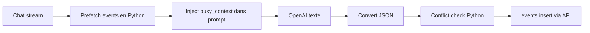
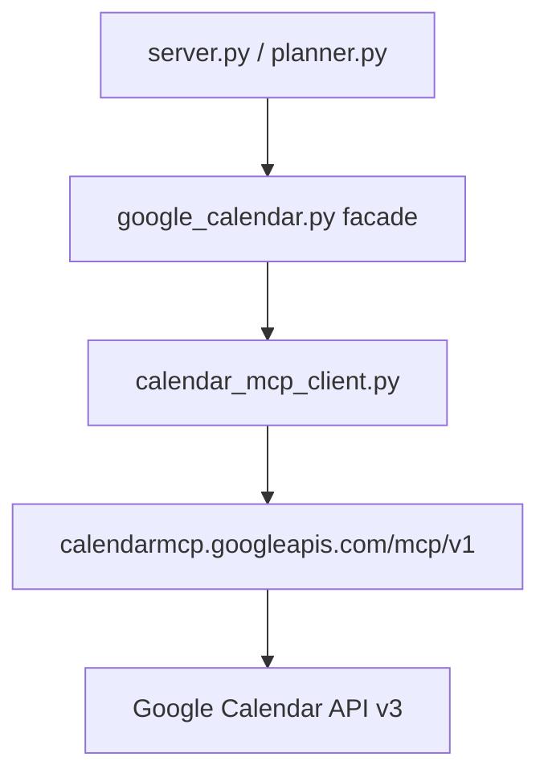
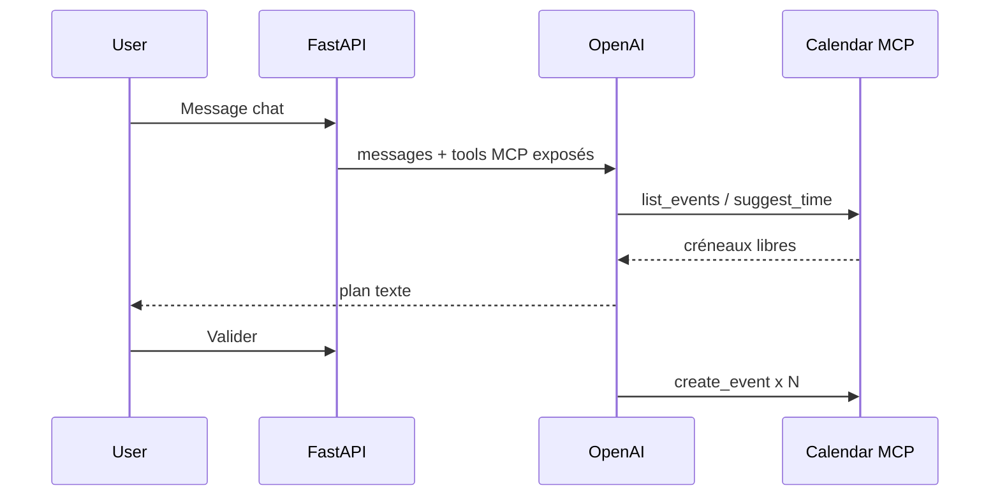

# Plan — Google Calendar API → Google Calendar MCP

Projet : Sports Sessions Planner  
Statut : **évaluation / planifié** (non implémenté)  
Endpoint officiel Google : `https://calendarmcp.googleapis.com/mcp/v1`

---

## Question centrale : est-ce que ça vaut le coup ?

**Verdict pour l’architecture actuelle : faible valeur — ne pas migrer maintenant.**

**Verdict si pivot agentique (coach qui appelle le calendrier dynamiquement) : valeur moyenne à élevée — à reconsiderer plus tard.**

| Critère | API directe (aujourd’hui) | MCP Google Calendar |
|---------|---------------------------|---------------------|
| Adéquation à FastAPI + pipeline déterministe | Excellente | Faible (MCP cible les clients IA) |
| Complexité OAuth | Connue, fonctionne (`InstalledAppFlow` + `token.json`) | OAuth orienté Gemini CLI / Claude Connectors ; intégration backend custom non documentée |
| Latence | 1 hop HTTP Google | 1 hop MCP + même API sous-jacente |
| Contrôle réponses (multi-calendrier, normalisation) | Total dans `google_calendar.py` | Dépend du schéma outils MCP ; logique merge à refaire |
| Tests / CI | Mock `googleapiclient` ou events fixtures | Mock session MCP ou HTTP remote |
| Dépendances | `google-api-python-client`, `google-auth-*` | + SDK MCP Python, client HTTP streamable, gestion OAuth MCP |
| Évolution Google | API Calendar v3 stable | MCP GA (mai 2026) ; couche au-dessus de la même API |
| Outils exclusifs MCP | — | `suggest_time`, `respond_to_event` |

### Pourquoi la valeur est limitée aujourd’hui

L’app n’est **pas** un agent MCP. C’est un pipeline fixe :



Le calendrier est lu **avant** l’appel LLM et écrit **après** conversion JSON, avec une logique de conflits explicite dans [`planner.py`](../src/planner.py). MCP apporte surtout de la valeur quand **le modèle choisit quels outils appeler** (list_events, suggest_time, create_event) au fil de la conversation.

Remplacer [`google_calendar.py`](../src/google_calendar.py) par un client MCP serait un **changement de transport** (API → protocole MCP → même API Google), sans simplifier le métier. On ajoute une couche, pas on enlève de la complexité.

### Quand MCP aurait de la valeur

1. **Pivot agentique** — le coach OpenAI reçoit les outils Calendar en function calling / MCP et interroge l’agenda à la demande ; `suggest_time` remplace une partie de la logique créneaux dans le prompt.
2. **Multi-produits Google** — même pattern MCP pour Gmail, Drive, etc. (peu pertinent pour ce produit).
3. **Dev dans Cursor** — configurer Calendar MCP dans l’IDE pour déboguer l’agenda pendant le dev (**sans toucher au backend prod**).

### Recommandation

| Option | Quand |
|--------|--------|
| **A. Garder l’API directe** (recommandé) | Continuer le MVP file import + UX ; calendrier déjà OK |
| **B. Hybrid dev-only** | Ajouter Calendar MCP dans `.cursor/mcp.json` pour l’équipe, zéro changement prod |
| **C. Migration transport MCP** | Seulement si contrainte orga « tout via MCP Google » |
| **D. Refonte agentique** | Projet séparé, plus gros ; MCP devient le cœur du scheduling |

---

## État actuel (API directe)

Fichier canonique : [`src/google_calendar.py`](../src/google_calendar.py)

| Fonction | Usage |
|----------|--------|
| `get_calendar_service()` | OAuth `InstalledAppFlow`, `token.json` |
| `list_upcoming_events()` | Lecture multi-cal (`GOOGLE_CALENDAR_IDS`), merge par date |
| `add_sessions_to_calendar()` | `events().insert` sur `GOOGLE_WRITE_CALENDAR_ID` |
| `calendar_connection_status()` | Probe + métadonnées pour la sidebar |
| `list_accessible_calendars()` | `calendarList().list()` |

Consommateurs :

- [`src/server.py`](../src/server.py) — `/api/calendar/status`, prefetch dans `/api/chat/stream`
- [`src/planner.py`](../src/planner.py) — busy context, conflits, écriture séances

Scope OAuth actuel : `https://www.googleapis.com/auth/calendar` (lecture + écriture).

---

## Google Calendar MCP officiel

**Documentation :** [Configure the Calendar MCP server](https://developers.google.com/workspace/calendar/api/guides/configure-mcp-server)

**Prérequis GCP :**

- Activer `calendar-json.googleapis.com`
- Activer `calendarmcp.googleapis.com` (Calendar MCP API)

**Outils exposés :**

| Outil MCP | Équivalent actuel |
|-----------|-------------------|
| `list_calendars` | `list_accessible_calendars()` |
| `list_events` | `list_upcoming_events()` |
| `create_event` | `add_sessions_to_calendar()` (1 event) |
| `update_event` / `delete_event` | Non implémenté aujourd’hui |
| `suggest_time` | **Nouveau** — pourrait aider en mode agentique |
| `get_event` / `respond_to_event` | Non utilisé |

**OAuth :** la doc Gemini/Claude montre des scopes **lecture seule** dans l’exemple de config ; pour `create_event`, il faudra ajouter des scopes d’écriture (`calendar.events` ou `calendar`) sur l’écran de consentement — à valider lors d’un spike.

**Contrainte connue :** le MCP remote Google est pensé pour Gemini CLI, Claude Connectors, etc. L’auth sans « dynamic client registration » pose problème à certains clients (voir [issue Anthropic](https://github.com/anthropics/knowledge-work-plugins/issues/180)). Un backend FastAPI devra probablement implémenter le flux OAuth MCP HTTP manuellement ou réutiliser les tokens existants — **zone à risque**, non couverte par la doc Google pour apps web custom.

---

## Option C — Migration transport (si imposée)

Objectif : même interface publique Python, implémentation MCP en dessous.

### Architecture cible



Garder les signatures :

```python
list_upcoming_events(max_results, calendar_ids) -> List[Dict]
add_sessions_to_calendar(sessions, calendar_id) -> None
calendar_connection_status() -> Dict
```

### Étapes

#### Phase 0 — Spike (1 jour, go/no-go)

- [ ] Créer projet GCP test ou réutiliser l’existant ; activer Calendar MCP API
- [ ] Depuis un script Python isolé, connecter le SDK MCP (`mcp` package) au endpoint remote avec OAuth Desktop
- [ ] Appeler `list_events` et `create_event` ; comparer latence et forme de réponse vs API directe
- [ ] Vérifier que les tokens `credentials/token.json` actuels **peuvent** être réutilisés ou s’il faut un 2ᵉ flux OAuth MCP
- **Critère go :** auth backend reproductible sans interaction navigateur à chaque requête

Si Phase 0 échoue sur l’OAuth → **rester sur API directe**.

#### Phase 1 — Client MCP (1 jour)

- [ ] Nouveau module `src/calendar_mcp_client.py` : session async, `call_tool("list_events", ...)`, `call_tool("create_event", ...)`
- [ ] Mapper les réponses MCP vers le dict normalisé actuel (`summary`, `start`, `end`, `calendarId`, …)
- [ ] Conserver merge multi-calendrier et tri dans la facade (MCP ne remplace pas cette logique)

#### Phase 2 — Remplacement facade (½ jour)

- [ ] Refactor [`google_calendar.py`](../src/google_calendar.py) : impl MCP derrière les mêmes fonctions, ou renommer en `google_calendar.py` → adapter qui délègue
- [ ] Feature flag `CALENDAR_BACKEND=api|mcp` pour rollback rapide

#### Phase 3 — Tests & doc (½ jour)

- [ ] Adapter [`test_calendar_config.py`](../src/tests/test_calendar_config.py) avec mocks MCP
- [ ] Golden path [`docs/golden-path.md`](golden-path.md) inchangé fonctionnellement
- [ ] README : activation MCP API, scopes, différences

#### Phase 4 — Nettoyage (optionnel)

- [ ] Retirer `google-api-python-client` si plus aucun appel direct (souvent on **garde** l’API en fallback)

**Effort estimé : 2–3 jours** (dont spike OAuth).  
**Risque principal :** OAuth MCP côté serveur, pas le mapping des outils.

---

## Option D — Refonte agentique (MCP à forte valeur)

Changement de paradigme : le LLM devient l’orchestrateur calendrier.



**Impacts majeurs :**

- Supprimer ou réduire le prefetch statique dans [`server.py`](../src/server.py)
- OpenAI function tools miroir des outils MCP, ou proxy MCP ↔ OpenAI tools
- Repenser conflits : soit `suggest_time`, soit garde-fous Python post-LLM
- Coût tokens ↑, comportement moins déterministe, tests plus difficiles
- Surface sécurité : prompt injection indirecte (Google le signale explicitement)

**Effort : 1–2 semaines** — traiter comme un epic séparé, pas un swap de lib.

---

## Option B — Hybrid dev-only (quick win, 30 min)

Sans toucher au backend :

1. Ajouter Calendar MCP dans la config Cursor du repo (`.cursor/mcp.json` ou settings utilisateur)
2. Endpoint `https://calendarmcp.googleapis.com/mcp/v1` + OAuth client Desktop existant
3. Utiliser en dev : « liste mes events cette semaine », debug conflits, comparer avec l’app

**Valeur :** confort développeur. **Zéro risque prod.**

---

## Comparaison des options

| | Effort | Valeur prod | Risque |
|--|--------|-------------|--------|
| A — Garder API | 0 | Suffisant | Faible |
| B — MCP dev-only | Très faible | Dev only | Faible |
| C — Migration transport | Moyen | Faible | OAuth / régression |
| D — Agentique MCP | Élevé | Élevé (si bien fait) | Comportement, sécurité, coût |

---

## Décision suggérée

1. **Court terme : Option A** — l’API directe est adaptée au pipeline actuel ; investir plutôt dans [plan-file-import.md](plan-file-import.md).
2. **En parallèle (optionnel) : Option B** — MCP dans Cursor pour debug agenda.
3. **Reporter Option C** sauf contrainte explicite.
4. **Envisager Option D** seulement si le produit évolue vers un coach fully agentic avec `suggest_time` et édition d’events existants.

---

## Checklist si migration Option C lancée

- [ ] Spike OAuth MCP depuis Python FastAPI (go/no-go)
- [ ] `calendar_mcp_client.py` + mapping réponses
- [ ] Facade `google_calendar.py` inchangée pour `planner.py` / `server.py`
- [ ] Flag `CALENDAR_BACKEND`
- [ ] Tests + golden path
- [ ] Scopes écriture validés pour `create_event`
- [ ] Plan rollback documenté

---

## Références

- [Google Calendar MCP — Configure](https://developers.google.com/workspace/calendar/api/guides/configure-mcp-server)
- [Google Workspace MCP overview](https://developers.google.com/workspace/guides/configure-mcp-servers)
- [Google Cloud MCP release notes](https://cloud.google.com/mcp/release-notes)
- Code actuel : [`src/google_calendar.py`](../src/google_calendar.py), [`src/planner.py`](../src/planner.py)
